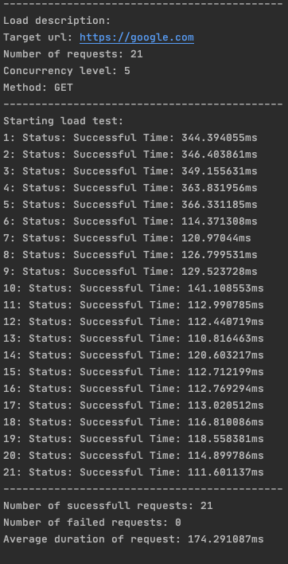

# `http-load` is a simple tool for http load testing.

## How to use it:

```bash
go build http-load
```

* Help:

```bash
./http-load --help 
```

* Command examples:

Simple request:

```bash
./http-load -n 6 -c 2 https://myEndpoint.com
```

Request with payload test: 
```bash
./http-load -n 6 -c 2 -m POST \
-h "Content-Type: application/json" \
-p "{\"name\": \"Dean\"}" https://myEndpoint.com
```


Alternatively, instead of passing a row payload you can use file: 
```bash
./http-load -n 6 -c 2 -m PUT \
-h "Content-Type: application/json" \
-f payload.json https://myEndpoint.com
```

* Real example
```bash
 ./http-load -n 21 -c 5 https://google.com
```
